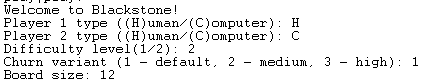

## Functional and Logic Programming 
### Second Project
# Blackstone - Prolog Implementation

## Introduction

In the context of the Functional and Logic Programming curricular unit, we were tasked with implementing a game using SICStus Prolog 4.9, in order to use and comprehend the features of logic programming. 

## Group

|Group Member | Student Number | Contribution |
|---|---|---|
| Gabriela Rodrigues da Silva | 202206777 | 50% |
| (insert here) | (insert here) | 50% |

## Installation and Execution

1) Ensure the correct installation of SICStus Prolog 4.9.
2) In the SICStus console,

## The Game - Blackstone
Blackstone is a two-player game designed by Blackstone in March 2024. It is played on a square board of any even size. The following screenshot demonstrates the initial configuration for a 8 by 8 board:

< image goes here >

Starting with the red player, each player can, in each turn, move one of their own pieces any number of steps in an unobstructed horizontal, vertical or diagonal path. Before the other moves, a black piece is placed on the square the moved piece had originally been.

< image showing a valid move >

If a red or blue piece is unnable to move, it is removed. In the medium churn variant, all black pieces _surrounding it_ are removed as well. In the high churn variant, _all_ black pieces are eliminated.

< image showing a piece dying >

A player wins when all of their oponent's pieces are eliminated. 

The reference used for the rules can be found [here](https://www.marksteeregames.com/Blackstone_rules.pdf).

## Extensions

In this implementation, we have integrated all churn variants described in the rules, as well as variable board sizes and two different difficulty levels for the computer players.

< see if we do more extensions >

## Logic, Arquitecture and Implementation

< small introcution >

### Game Configuration Representation

In order to create the initial game state, information is requested from the user, and passed to the initial_state(+GameConfig, -GameState) function.

The GameConfig term matches the format gameConfig(P1Type,P2Type,ChurnVariant,Size), where:
   - P1Type and P2 are either player(h), signalling a human player, or player(c-DifficultyLevel) otherwise, with DifficultyLevel being either 1 or 2.
   - ChurnVariant is a number between 1 and 3
   - Size is an even number greater than 6, representing the size in squares/positions of the side of the square board.

### Internal Game State Representation

To represent a game state, the term state(TurnNumber, Player1, Player2, Variant, Board) is used, where:
   - TurnNumber is a number starting at 0 that is incremented every turn.
   - Player1 and Player2 are player configurations identical to that of gameConfig (player(h),player(c-DifficultyLevel)).
   - Variant is a number between 1 and 3.
   - Board is a list of lists of characters, representing the piece ('r' ofr red, 'b' for blue, 'x' for black), or lack thereof (' '), in each position.

### Move Representation

To represent a move, the term move(OX-OY, TX-TY) is used, where:
   - OX-OY is the original position of the piece the player wants to move.
   - TX-TY is the position to which the player wants to move it.  
The coordinate of the top-left of the board is 0-0.

### User Interaction

During the main loop of the game, user interaction is handled by the predicate choose_move(+GameState, +Level, -Move), which takes into account the turn number - used to determine which player's turn it is - and whether that player is a computer or human.

< image showing the player input form for choose_move >

< a paragraph or two and maybe some images about how errors are handled and recovered from >

< although no more sections are indicated in the project sheet, I think we should include here a new section with some implementation details of the code>

## Conclusions

## Bibliography