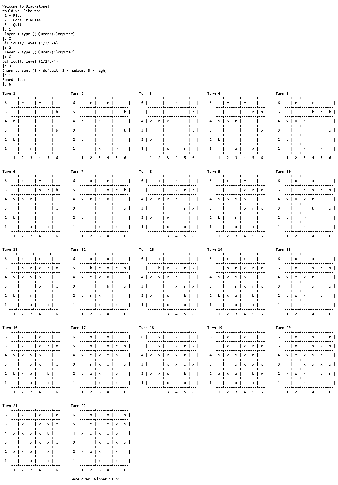

# Blackstone - Prolog Implementation

## PFL - Practical Assignment 2

## **Introduction**

In the context of the Functional and Logic Programming curricular unit, we were tasked with implementing a game using SICStus Prolog 4.9, in order to use and comprehend the features of logic programming.

## **Group**

| Group Member | Student Number | Contribution |
| --- | --- | --- |
| Gabriela Rodrigues da Silva | 202206777 | 50% |
| Vítor Manuel Pereira Pires | 202207301 | 50% |

## **Installation and Execution**

### Prerequisites

1. Ensure that SICStus Prolog 4.9 is correctly installed (more information available [here](https://sicstus.sics.se/download4.html)).

### Steps to Run the Game

1. Download the zip of code from GitHub, and extract to some folder; or clone the repository.
2. Use the following commands to start the game:
- **Linux**: open the extracted folder in the terminal and run:

```
cd src/
sicstus
consult('game.pl').
play.
```

- **Windows**: open the SICStus Prolog, consult the `game.pl` file and run `play.` in the SICStus terminal.

## **The Game - Blackstone**

**Blackstone** is a two-player strategy game, designed by Mark Steere in March 2024, where players compete to eliminate their opponent’s pieces or all pieces on the board. It is played on a square board of any even size with a side length 6 or longer. The following screenshot demonstrates the initial configuration for a 8 by 8 board:

**Game State**

```prolog
(
   1, % Turn number
   player(h,'r'), % Player 1 - human (red stones)
   player(c-2,'b'), % Player 2 - computer ("hard" mode, blue stones)
   [
      [' ','r',' ','r',' ','r',' ',' '],
      [' ',' ',' ',' ',' ',' ',' ','b'],
      ['b',' ',' ',' ',' ',' ',' ',' '],
      [' ',' ',' ',' ',' ',' ',' ','b'],
      ['b',' ',' ',' ',' ',' ',' ',' '],
      [' ',' ',' ',' ',' ',' ',' ','b'],
      ['b',' ',' ',' ',' ',' ',' ',' '],
      [' ',' ','r',' ','r',' ','r',' '],
   ], % 8x8 board
   1 % Churn variant
)
```

**Board Display**

<div align="center">
   
</div>

### Game Rules

1. Starting with the red player, each player can, in each turn, move one of their own pieces any number of steps in an unobstructed horizontal, vertical or diagonal path. Before the other moves, a black piece is placed on the square the moved piece was originally located.
2. If a red or blue piece cannot move, it is removed. In the medium churn variant, all black pieces **surrounding it** are removed as well. In the high churn variant, **all** black pieces are eliminated.
3. A player wins by either:
    - eliminating all of their opponent's pieces;
    - eliminating all blue and red stones on the board.

The reference used for the rules can be found [here](https://www.marksteeregames.com/Blackstone_rules.pdf).

## **Extensions**

In this implementation, we have integrated all **churn variants** described in the rules, as well as variable board sizes and four different difficulty levels for the computer players.

### **Churn variants:**

- **1 - Low Churn Variant** (Default): after making a move, if any red or blue stones are surrounded by adjacent stones of any of the three colors and completely blocked from moving, they must be removed from the board.
- **2 - Medium Churn Variant**: if the move blocks red or blue stones, remove those stones and also the black stones that contributed to the kills.
- **3 - High Churn variant**: if the move blocks red or blue stones, remove those stones and also all the black stones from the board.

### **Difficulty levels:**

- **1 - Easy** (Simple Bot): The AI chooses a random move from the list of valid moves.
- **2 - Hard** (Expert Bot): The AI "greedily" chooses a move from the list of valid moves.
- **3 - Smartest** (Minimax Bot): The AI aims to maximize the value heuristic associated with one player considering that the other is trying to minimize it by iterating through states up to a given depth, with alpha-beta pruning.
- **4 - Smart** (Brute-Force Bot): The AI tests every reachable state up to a certain depth, considering that its opponent always makes the greedy choice. It selects the move that can lead to the final state with the most value in these conditions.

**Note**: By changing the depth of search in both advanced AIs, we could generate more difficulty levels.

## **Logic, Architecture and Implementation**

The development of this application involved multiple components. Decisions were made regarding the representation of data, the design of player interaction mechanisms, and the implementation of algorithms, as well as the selection of modules provided by `SICStus`, namely the *lists* and *between* modules.

### **Game Configuration Representation**

In order to create the initial game state, information is requested from the user, and passed to the initial_state(+GameConfig, -GameState) function.

<div align="center">
   
</div>

The `GameConfig` term matches the format `gameConfig(P1Type, P2Type, ChurnVariant, Size)`, where:

- `P1Type` and `P2Type` are either `player(h,Color)`, signalling a human player, or `player(c-DifficultyLevel,Color)`otherwise, with `DifficultyLevel` being a number between 1 and 4.
- `ChurnVariant` is a number between 1 and 3
- `Size` is an even number greater than 6, representing the size in squares/positions of the side of the square board.

### **Internal Game State Representation**

To represent a game state, the term `state(TurnNumber, Player1, Player2, Variant, Board)` is used, where:

- `TurnNumber` is a number starting at 1 that is incremented every turn.
- `Player1` and `Player2` are player configurations identical to that of `gameConfig(player(h,Color),player(c-DifficultyLevel,Color))`.
- `Variant` is a number between 1 and 3.
- `Board` is a list of lists of characters, representing the piece (`'r'` for red, `'b'` for blue, `'x'` for black), or lack thereof (`' '`), in each position.

**Note**: We could not use assert or retract to store / manipulate game configuration or game state information. So, to access information from the game configuration, namely players and churn variant, we included it in the game state term.

### **Move Representation**

To represent a move, the term `move(OX-OY, TX-TY)` is used, where:

- `OX-OY` is the original position of the piece the player wants to move.
- `TX-TY` is the position to which the player wants to move it.

**Note**: Although these coordinates are `0-0` at the top left corner -  due to  the internal representation of the board as a list of lists (rows) -, display and player move inputs are translated to and from, respectively, a coordinate system with `1-1` at the **lower left corner**.

### **User Interaction**

During the main loop of the game, user interaction is handled by the predicate `choose_move(+GameState, +Level, -Move)`, which takes into account the turn number - used to determine which player's turn it is - and whether that player is a computer or human.

<div align="center">
   
</div>

To avoid an application shutdown or other unexpected behavior, techniques such as well-placed cuts and additional predicates that verified input before continuing with the next iteration of a loop were used. The following predicate demonstrates both of these techniques:

```prolog
validate('C',GameConfig):-% computer player - asks for a difficulty value
    !,
    input_form_difficulty(GameConfig).

validate('H',GameConfig):-%player is human - proceeds to second player question
    !,
    input_form(player(h,'r'),GameConfig).
validate(_,GameConfig):-% invalid input - repeats first player question
    write('Invalid input!\n'),
    input_form(GameConfig).
```

Moreover, custom `read_number` predicates was created, as the `get_char` and `get_code` predicates were favored over `read`.

At the end of the game, the player gets a prompt asking if they want to play again, possibly with different game settings.

### **Implementation Details**

### Obtaining Valid Moves

The `valid_moves` predicate consists of a single call to `findall`, with the actual listing of moves being generated by the `move/3` predicate. Using backtracking, it checks, for each of the player’s pieces, all empty positions in its row, column or diagonal without a piece in between.

```prolog
move(state(TurnNumber, Player1, Player2, ChurnVariant, Board), move(OX-OY, TX-TY), state(NTurnNumber, Player1, Player2, ChurnVariant, NBoard)):-
	get_turn_color(TurnNumber, TurnColor),
	get_piece_at(OX-OY, Board, TurnColor),
	get_piece_at(TX-TY, Board, ' '),
	is_in_line_of_sight(OX-OY, TX-TY),
    \+ (has_piece_between(Board, OX-OY, TX-TY)),
	create_new_board(TurnColor, Board,  move(OX-OY, TX-TY), B2),
	remove_dead_pieces(ChurnVariant, B2, NBoard),
	NTurnNumber is TurnNumber + 1.
```

### **Value Function**

To determine the value heuristic for a given player and state, the number of pieces of each player that are on the board are taken into consideration, as well as the number of valid moves available:

- Value = #Our_Pieces - #Other_Player_Pieces + ((#AvaibleMoves-#AvaibleEnemyMoves)/BoardArea)

### Negamax Algorithm

**Minimax** algorithm is based on two players: one that seeks to maximize their score, and the other who seeks to minimize it. The game state is evaluated from the perspective of the player making the initial move. Therefore, at each level of the game tree, the **maximizing player** will choose the child node with the highest value; the **minimizer player** will choose the child node with the lowest value.

**Negamax** is a simplified variant of Minimax that exploits the **zero-sum** property of two-player games (the value of a state for one player is the negation of its value for the opponent). Instead of alternating between maximizing and minimizing levels, we use the following equivalence `max(a,b)=−min(−a,−b)` (this allows the algorithm to consistently apply the maximizing strategy at every level). Alpha (α) and beta (β) represent lower and upper bounds for child node values at a given tree depth.

**Alpha-beta pruning:** eliminates branches where the outcome cannot improve the current best result (i.e., the player can’t guarantee a better position - α-prune - or the opponent can’t force a worse position - β-prune).

## **Conclusions**

This project allowed us to apply the knowledge we have gained of logic programming and Prolog to develop a game. We collaboratively designed and agreed upon consistent representations for the data structures used throughout the code. Moreover, several algorithms were explored: a greedy algorithm to select the most favorable current move, a minimax algorithm with alpha-beta pruning implemented with depth-first search, and another approach utilizing breadth-first search. Additionally, we made efforts to ensure the game was robust against player input errors.

### Future work

- At this moment, the value heuristic calculation and AI opponent calculations diminish with large board sizes or increased depth. In order to deal with this problem, further optimizations or alternative solutions could be considered in the future.

## **Bibliography**

[1] Carlsson, M. et al. (2023). *SICStus Prolog User’s Manual*. (Version 4.9.0). Retrieved November 30, 2024, from [https://sicstus.sics.se/sicstus/docs/latest4/html/sicstus.html/](https://sicstus.sics.se/sicstus/docs/latest4/html/sicstus.html/)

[2] Elnaggar, A. A.; Aziem, M. A.; Gadallah, M.; El-Deeb H. (2014). “A Comparative Study of Game Tree Searching Methods”. *International Journal of Advanced Computer Science and Applications*, Volume 5. Retrieved January 2, 2025, from [https://www.researchgate.net/publication/262672371_A_Comparative_Study_of_Game_Tree_Searching_Methods](https://www.researchgate.net/publication/262672371_A_Comparative_Study_of_Game_Tree_Searching_Methods)

[3] Heineman, G. T.; Pollice, G.; Selkow, S. (2016). “Path Finding in AI”. *Algorithms in a Nutshell*. (2nd ed, pp. 169-215). O’Reilly Media.

[4] Steere, M. (2024). “Blackstone”. Mark Steere Games. Retrieved November 22, 2024, from [https://www.marksteeregames.com/MSG_game_index.html](https://www.marksteeregames.com/MSG_game_index.html)

**Note**:  We have used Generative AI to selectively assist with debugging. Specifically, it was used in AI functions, when the `trace` output proved too verbose and `write` statements embedded in the code were insufficient for identifying the source of bugs.

## Appendix I - NegaMax with Alpha-Beta Pruning Pseudo Code

```
function NegaMax(gameState, depth, alpha, beta) {
	if(depth = 0 || Game is over)
		return Value(gameState); /* evaluate leaf GameState from current player's standpoint */
	
	score ← -∞;
	moves ← ValidMoves(gameState);
	
	for i ← 1 to sizeof(Moves) do {
		move(Moves[i]);
		cur ← -NegaMax(gameState, depth-1, -beta, -alpha);
		
		score ← max(score, cur);
		alpha ← max(alpha, score);
		
		if alpha >= beta then {
			break; /* cut-of */
		}
	}
	
	return score;
}
```

## Appendix II - Gameplay


